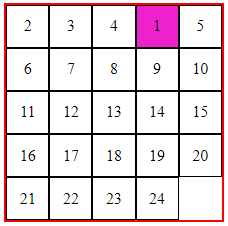

# CSS Grid 實例講解

> 大家好，我是 KO，
> Grid 是 CSS 的新排版神器，有了它就可以輕鬆進行元素定位，
> 隨著支援度的提升，目前主流瀏覽器已大都支援 CSS Grid，終於可以不用再與 float/clear 拼搏了…
> 您是否也想跟上這股潮流？就讓我們一起來 KO 它吧！

想要完整的了解它可以看這篇[A Complete Guide to Grid](https://css-tricks.com/snippets/css/complete-guide-grid/)，
英文看起來怕怕是嗎？那就先看 [與 CSS Grid 的第一次接觸](https://blog.techbridge.cc/2017/02/03/css-grid-intro/) 及 [CSS Grid 屬性介紹](https://wcc723.github.io/css/2017/03/22/css-grid-layout/) 這兩篇吧！
如果已經有些基礎，可以挑戰 [GRID GARDEN](http://cssgridgarden.com/) 看看。

這邊是要用一些實驗來看 grid 的運作細節……

---

Grid 的運作要分為內部(grid items)及外部(grid container)來看，
Container 是用來規劃整個 grid 的格局：

```css
/*  grid container */
.container {
  display: grid;
  /* % 是以 container 的長度來分配 */
  grid-template-columns: 20% 20% 20% 20% 20%;
  /* 可以用 repeat 來設定重複的格線間距 */
  /* === 20% 20% 20% 20% 20% */
  grid-template-rows: repeat(5, 20%);
}
```

```html
<div class="container">
    <div class="item item-1">1</div>
    <div class="item item-2">2</div>
    <div class="item item-3">3</div>
    <div class="item item-4">4</div>
    <div class="item item-5">5</div>
    <div class="item item-6">6</div>
    <div class="item item-7">7</div>
    <div class="item item-8">8</div>
    <div class="item item-9">9</div>
    <div class="item item-10">10</div>
    <div class="item item-11">11</div>
    <div class="item item-12">12</div>
    <div class="item item-13">13</div>
    <div class="item item-14">14</div>
    <div class="item item-15">15</div>
    <div class="item item-16">16</div>
    <div class="item item-17">17</div>
    <div class="item item-18">18</div>
    <div class="item item-19">19</div>
    <div class="item item-20">20</div>
    <div class="item item-21">21</div>
    <div class="item item-22">22</div>
    <div class="item item-23">23</div>
    <div class="item item-24">24</div>
    <!-- <div class="item item-25">25</div> -->
    <!-- <div class="item item-26">26</div> -->
    <!-- <div class="item item-27">27</div> -->
  </div>
```

沒看錯，item-25~27 是故意留空，好讓你看清楚後面的一些狀況！關於 grid container 的用法除了後面提到的外，詳細用法請去看最上方的那些參考文件。下面是用 Chrome DevTools 看 grid container 的格局：

 "Grid Container 格局"

從上面可以清楚的看到，item 依 HTML 宣告的順序，依序地被插入 grid 的格子中。

這邊先看看 item 數超過 container 格數會怎樣：

 "Item 數超過 Container 格數"

它會自動排在後面，但不會擠開 container。

為了方便識別，先來為所有的 items 加上框線：

```css
.item {
  border: 1px solid black;
}
```


grid-gap 是用來設定格線寬度，
但要注意，grid-gap 是額外加入的空間，即有可能超出 container 的範圍：

```css
.container {
  grid-gap: 1%;
}
```

 "加入 grid-gap 的情況"

將 template 改為 fr/auto 之後，可以發現 auto/fr 那欄/列 都被擠壓到符合 container 的大小了：

```css
.container {
  /* ... */
  grid-template-columns: 20% 20% 20% 20% auto;
  grid-template-rows: repeat(4, 20%) 1fr;
}
```

 "加入 grid-gap 的情況(template 帶有 fr/auto)"

整理一下，grid-template 如果是指定比例，計算時是以 container 的寬高來分配，grid-gap 是額外加入的空間；
但如果 grid-template 存有 fr/auto 時，這些 fr/auto 是以原本剩餘空間再扣除 grid-gap 後的空間來計算。

---

接下來看看 Grid 內部 items 的設法吧……
它是用來設定個別 item 要放在哪個格子、所佔範圍及排列順序。

首先，我們來看看 order：

```css
.item-10,
.item-20 {
  order: -1;
}
```

 "將 item-10, item-20 加入 order: -1"

Order 是用來指定 item 的排序權重，
預設值是 0，
可設定正負值，
越小的權重越大，
權重相同則依 html 元素宣告順序。

---

接著來看看個別指定 item 的位置，
一般而言，要指定一個 item 的具體區域，
會用到 grid-column-start, grid-column-end, grid-row-start, grid-row-end 四個參數。
這邊我們想把 item-1 定位到第一列的第四欄：

```css
.item-1 {
  /* 數字表示第幾條格線；span 數字表示佔幾格 */
  grid-column-start: 4;
  grid-column-end: 5;
  grid-row-start: 1;
  grid-row-end: span 1;
}
```



指定後，原本的位置會由其後面未個別指定的 item(本例是 item-2~4) 來補進。

上面是用了四個參數來定位 item-1，其實也可以只下這行來達成：

```css
.item-1 {
  grid-column-start: 4;
}
```


有沒有發現不一樣的地方？說明之前，我們先再看看加入 order 的狀況：

```css
.item-10,
.item-20 {
  order: -1;
}
```


```css
.item-10,
.item-20,
.item-21,
.item-22 {
  order: -1;
}
```


意想不到吧！
現在就來說說只加入 **_grid-column-start: 4_** 這個參數，
它表示選取第 4 條分隔線當作起點，它其實隱含 **_grid-column-end: 5_**，也就是只有取一個格位。
當然，因為沒指定 row，所以也就只有取第一列。

而當設定 order 之後，item-10 及 item-20 會排到 item-1 前面去，這也不意外。

但當排到 item-1 前面的 item 數量超過 itme-1 原本要的位置時，item-1 會被擠到下一列去！
此外，聰明的您應該也發現到--沒有指定 row 時，item-1 前面是不會把自然排序的 item 拉到前面去(例如：item-2, 3...)。

還不是很清楚嗎？我們再補入 **_grid-row-start: 1_**：

```css
.item-1 {
  grid-column-start: 4;
  grid-row-start: 1;
  background-color: #e2c;
}
```


很神奇吧！竟然明確指定 item-1 的 column 及 row 後，它就不管權重了，item-1 先佔位，其他的往後順延(本例是 item-22)。
這裡可以得到一個佔位原則：絕對位置 > 自然排序(order 小) > 自然排序(order 大)

下面再來看一個把 item-5 加入 order 及 grid-area 的例子：

```css
.item-5 {
  /* grid-area == grid-column + grid-row == grid-column-start + grid-column-end + grid-row-start + grid-row-end */
  grid-area: 1/2/2/3; /* row-start/col-start/row-end/col-end */
  order: 1000;
}
```


其實，這邊的 order 不設結果對是一樣，因為 絕對位置 > 自然排序。

我們再把 item-4 設到 item-1 的位置看看：

```css
.item-4 {
  grid-area: 1/4/2/5;
  order: 2000;
  background-color: yellow;
}
```


用上面的法則分析一下，item-1 和 item-4 都是絕對位置，所以看權重，但竟然權重較大的 item-1 不旦沒有顯現，item-4 也沒有被擠到後面去……
這邊得到一個原則：都是絕對位置的元素間不會有排序問題，只與圖層顯示有關，order 的作用相當於 z-index，值越大的越上層。
但是如果設定 css 的老大哥 z-index 的話，還是「**大哥說了算**」！！

```css
.item-1 {
  z-index: 1;
}
```


最後，我們再看一個更極端的例子(有把 item-1 的 z-index 拿掉)：

```css
.item-5 {
  grid-area: 1/2/2 / span 30;
  order: 1000;
}

.item-4 {
  grid-area: 1/4/2/5;
  order: 2000;
}
```


這個極端例子可以觀察到：

- item-5 覆蓋了 item-1
- item-4 覆蓋了 item-1，也覆蓋了 item-5，

原因是三個都為絕對位置，所以只以 order 來比顯示圖層的順序。
另外，可以看到當 item-5 row 長度超出 container 邊界時，是會一直向右延伸，
等於把 grid-template-rows 加長，所以原本各列的元素都被補進到第二列，
細心的您應該也注意到了，item-5 實際上沒有到 30 格，它只延伸到其後所有的元素都補進到第二列後就不再展延了！

還有由於前面 grid-template-rows 只設了 5 個 20%，右邊超出的都變成 auto 了，
原本應該是等寬的(0)，但都視所含 item 內容而被擴展。

## 結論

在使用 grid 時，要從內(items)及外(container)兩面向來設定，
設定時，要注意會隨著參數的不同、參數值的定義方式的不同，
而影響 grid 的排序及圖層順序，
以及是否超出 container 的範圍。

從上面的實驗當中，我們可以歸納成幾點：

- 具體指定 item 位置(包含 column 及 row)，它是絕對定位，具有最高權限，其前的空位會依序把後面屬於自然(預設)排序的元素往前補進。
- 只指定 cloumn 位置的，它會視其前面已填滿的格式而定，若所需的欄位已有元素，會跳到下面一列；另外，它不會把後面自然排序的元素往前拉(有較低 order 值除外)。
- order 具有兩種情況：
  - 調整自然排序的物件進行順序，值越小的權重越大，權重相同則依 html 元素宣告順序。
  - 調整絕對位置的元素進行圖層順序，不過它是值越大排在越上面，其作用就像是 z-index，但若有設 z-index 會先比 z-index。

本篇文章是想藉由圖例來更了解 grid 的細節，避免掉坑，期望對您有所助益。
下一篇將從一個 grid 排版案例出發，除了讓各位了解如何使用 grid 排版，還會比較一位新手及一個熟手在寫法上差別，敬請期待。
